# Kanji Mindmap Hacks 🧠

A collection of Kanji visualization hacks using Mermaid.js mindmaps.
Focus on **radicals as centers** and **mnemonic stories** as branches.

## Concept

Instead of rote memorization, we group Kanji by their shared radical (the "root") and use visual storytelling for the branches.

### Example: The "Small Bird" (隹) Family

```mermaid
mindmap
  root((隹<br/>Bird))
    雄_Male
      (💪 Arm/Flex)
      ::icon(fa fa-mars)
      [Male/Hero]
    雌_Female
      (🛑 Stop + Spoon)
      ::icon(fa fa-venus)
      [Female]
    難_Difficult
      (😫 Clay/Sigh)
      [Hard/Disaster]
```

## Structure

- `maps/`: Contains markdown files with Mermaid diagrams, organized by radical.
- `hacks/`: Text-based mnemonic stories.

## Contributing

1. Pick a radical.
2. Find confusing Kanji sharing it.
3. Create a mindmap connecting them with "hacks".
