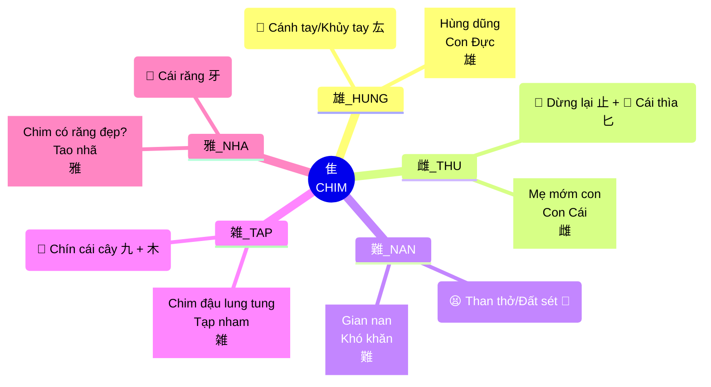

# 🐦 Bộ: 隹 (CHIM - Furutori)

**Concept:** Các chữ có bộ 隹 thường liên quan đến chim chóc, nhưng trong mnemonic hacks, chúng ta dùng hình ảnh "Con Chim" làm mốc.

```mermaid
mindmap
  root((隹<br/>CHIM))
    雄_HUNG
      (💪 Cánh tay/Khủy tay 厷)
      ::icon(fa fa-mars)
      [Hùng dũng<br/>Con Đực<br/>雄]
    雌_THU
      (🛑 Dừng lại 止 + 🥄 Cái thìa 匕)
      ::icon(fa fa-venus)
      [Mẹ mớm con<br/>Con Cái<br/>雌]
    難_NAN
      (😫 Than thở/Đất sét 𡆉)
      [Gian nan<br/>Khó khăn<br/>難]
    雑_TAP
      (🌲 Chín cái cây 九 + 木)
      [Chim đậu lung tung<br/>Tạp nham<br/>雑]
    雅_NHA
      (🦷 Cái răng 牙)
      [Chim có răng đẹp?<br/>Tao nhã<br/>雅]
```
